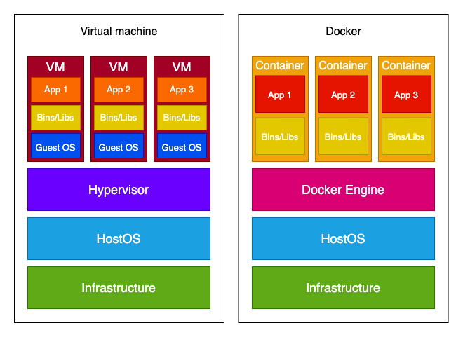
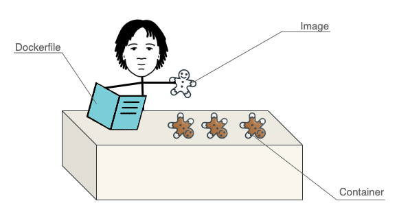

# Docker for beginners

## Objectives

By the end of this article, you should be able to:
1. Understand what Docker is and how it works
2. Understand what is a Dockerfile, Docker image, and Docker container and differentiate between them
3. Have an idea of what Dockerfile looks like and what basic commands in it mean
4. Understand more complicated tutorials using Docker


## Introduction

Per [Stack Overflow's 2020 Developer Survey](https://insights.stackoverflow.com/survey/2020#technology-platforms), Docker is one of the most popular development platforms, so you've probably heard of it already.

Docker is a tool that developers use to create a separate environment for each application.

In now almost famous image, Docker is compared to virtual machines:



Docker and virtual machines are similar in that they allow multiple apps to run on the same server with various software requirements (different python versions, different libraries, etc.).
Their main difference is in the operating system. 
Where Docker uses the hosts operating system, each virtual machine has its own guest operating system on top of the host OS.

If you have applications that need to run on different operating systems, VM is the way to go.

But if that's not a requirement, Docker has multiple advantages to VM:
1. Lightweight
2. Faster to build
3. Can be easily ported across different platforms.
4. Less resource intensive
5. Scaling up and duplicating is easier

All those advantages are due to Docker containers not needing their own OS.


## About Docker

When people say Docker, they can refer to multiple things.

When someone uses the word *Docker* when referring to the *open source containerization technology*, they're actually talking about **Docker Engine**.
*Docker Engine* is a technology for building and containerizing applications.
It acts as a client-server application where:
1. [Docker daemon](https://docs.docker.com/engine/reference/commandline/dockerd/) (called *dockerd*) acts as a server. It manages Docker objects such as images and containers. 
1. [Docker client](https://docs.docker.com/get-started/overview/#the-docker-client) (called *docker*) is the command line interface. It is the primary way of interacting with Docker daemon (other options are Docker Compose or [language-specific SDKs](https://gdevillele.github.io/engine/reference/api/remote_api_client_libraries/)). When using commands such as `docker run`, you're using *Docker client*.
1. [Docker Engine API](https://docs.docker.com/engine/api/latest/) is used so a client can interact with *dockerd*. 


If you try to install Docker these days, Docker will lead you to install Docker Desktop.
This is Docker's IDE that, among [other technologies](https://docs.docker.com/desktop/)(e.g., Docker Compose), also includes Docker Engine.

**It's important to understand that Docker Desktop ≠ Docker (Engine).**

You can follow the installation guide for Docker Desktop depending on your OS:
- [Linux](https://docs.docker.com/desktop/install/linux-install/)
- [MacOS](https://docs.docker.com/desktop/install/mac-install/)
- [Windows](https://docs.docker.com/desktop/install/windows-install/)

> Upon Docker Desktop installation, it will take you through a little show and tell on its own.

At the heart of Docker, there are three core [concepts](https://docs.docker.com/get-started/overview/):
1. [Dockerfile](https://docs.docker.com/glossary/#dockerfile) - a text file that serves as a blueprint for your container. In it, you define a list of instructions for the [layers](https://docs.docker.com/glossary/#layer) from which the image will be built.
2. [Image](https://docs.docker.com/glossary/#image) - a read-only embodiment of the Dockerfile. it's built out of layers -- each layer corresponds to one line of instructions in the Dockerfile (e.g., installing the requirements is one layer). Images can be stored and shared on [DockerHub](https://docs.docker.com/docker-hub/), which is Docker's library for container images.
3. [Container](https://docs.docker.com/glossary/#container) - running a Docker image produces a container, which is a controlled environment for your application. If we draw parallels with object-oriented programming, a container is an instance of a Docker image.



*Dockerfile is used to create Docker image, which is then used to create (multiple) containers*

We'll look into all three core concepts in detail in the next few subsections.

> This article can be read-only.
> However, if you want to follow along, I provided a [HelloWorld application](TODO: link) that already includes a Dockerfile you can use to play around.


## Dockerfile

*Dockerfile* is a text file that contains instructions for Docker on how to build an image.
By default, a Dockerfile has no extension, but you can add one if you need more than one -- e.g., *Dockerfile.prod*.

This is an example of how a very simple Dockerfile looks like:

```Dockerfile
FROM python:3.10-slim-buster

WORKDIR /usr/src/app

ENV PYTHONDONTWRITEBYTECODE 1
ENV PYTHONUNBUFFERED 1

RUN pip install --upgrade pip
COPY ./requirements.txt .
RUN pip install -r requirements.txt

COPY . .

CMD uvicorn main:app --reload --host 0.0.0.0 --port 8000
```

> This example is as simple as can be, so you can easily understand it.
> It does not adhere to [best practices](https://testdriven.io/blog/docker-best-practices/), but you should try to follow them in your *Dockerfiles*.

Dockerfile is essentially a list of [commands](https://docs.docker.com/engine/reference/builder) in a form: `INSTRUCTION arguments`.
The majority of the most widely used commands can be seen in the `Dockerfile` above.

TODO Michael: I didn't explain shell vs. exec commands as it's already confusing enough. 
I also use shell form everywhere (because most tutorials, including TDio, use it), despite not being the best practice. 
Do you think it's necessary to address that / should I use the exec form?

Let's look at them in detail--

### FROM

All Dockerfiles include a parent/base image on which the new image will be built.
You use the `FROM` instruction to define which parent image will you use to build your own.
Valid *Dockerfile* always includes **exactly one** `FROM` instruction.

> Although *parent* and *base* image terms are sometimes used interchangeably, there's a difference between them.
> Parent image has its own parent image. Base image has no parent; it starts with `FROM scratch`.
> [Alpine image](https://github.com/nodejs/docker-node/blob/c97bb67fb82bb10fd199cb4c4e57b3ab43605a9c/18/alpine3.15/Dockerfile) is a base image and [Python:alpine](https://github.com/docker-library/python/blob/9fd031d91ced6ddc1bf1f0f34b893ad82fa0d010/3.11-rc/alpine3.16/Dockerfile) is a parent image (whose parent(base) image is actually the alpine image).
>
> It's possible to create a [base image on your own](https://docs.docker.com/develop/develop-images/baseimages/), but the probability of you needing your own image is small.

We've already mentioned Docker's library for images, [DockerHub](https://hub.docker.com/search?q=&type=image), where you can find the parent images.
You'll probably want to use official images since they're actively rebuilt for updates and security fixes and adhere to [Docker best practices](https://docs.docker.com/develop/develop-images/dockerfile_best-practices/).

In the example above, we're using [python parent image](https://hub.docker.com/_/python), specifically `python:3.10-slim-buster`.

Official images are tagged in somehow similar matters.
The number tells you which version of the technology image is using (e.g., Image `python:3.11.0a5` is using Python version *3.11.0a5*, `node:18.9.0` is using Node version *18.9.0*).
`rc` as part of the version (e.g. `python:3.11.0rc2` ) means *release candidate*, which you want to avoid - this is not yet a stable version.
Names like *buster*, *bullseye*, or *alpine* tell you which OS images were used for this image (*buster* and *bullseye* refer to Debian releases, *alpine* is a lightweight Linux distribution).
Additionally, there are tags such as `slim` that use a lighter version of the full image and `windowsservercore` that is used for the Windows Server container.

**Example of `FROM` instruction usage:**
```Dockerfile
FROM python:3.10-slim-buster
```

### RUN

The [RUN instruction](https://docs.docker.com/engine/reference/builder/#run) will execute any commands in a new layer on top of the current image and commit the result.

**Examples of `RUN` instruction usage:**
```Dockerfile
RUN mkdir /home/app/web
RUN python manage.py collectstatic --noinput
```

### ENV

You use [ENV](https://docs.docker.com/engine/reference/builder/#env) instruction to set an environment variable.
This variable will be available in all subsequent instructions.

**Examples of `ENV` instruction usage:**
```Dockerfile
ENV TZ=UTC
ENV HOME=/home/app
```

### CMD and ENTRYPOINT

Some Docker instructions are so similar it can be hard to understand why both commands are needed.
One of those "couples" are [CMD](https://docs.docker.com/engine/reference/builder/#cmd) and [ENTRYPOINT](https://docs.docker.com/engine/reference/builder/#entrypoint).

First, for the similarities:
`CMD` and `ENTRYPOINT` both specify a command / an executable that will be executed when running a container.
Unlike `RUN`, which executes the command right away (the result is used in the image layer), the `CMD`/`ENTRYPOINT` command in the build-up specifies the command that will be used only when the container starts.
You can have only one `CMD`/`ENTRYPOINT` instruction in a Dockerfile, but it can point to a more complicated executable file.

There's actually only one difference between those instructions-
`CMD` can easily be overridden from Docker CLI.

You should use `CMD` if you want the flexibility to run different executables depending on your needs when starting the container.
If you want to clearly communicate that command is not meant to be overridden and prevent accidentally changing it, use `ENTRYPOINT`.

When using Docker, you'll probably use one or the other - without an executable, the container will be stopped immediately since there's no reason for it to exist (the exception being if you're also using `docker-compose` that handles it differently).
You may also use both `CMD` and `ENTRYPOINT` in the same Dockerfile, in which case `CMD` serves as the default argument for the `ENTRYPOINT`.

**Example of `CMD` instruction usage:**
```Dockerfile
CMD gunicorn core.wsgi:application --bind 0.0.0.0:$PORT
```

There's a big chance you'll see the `ENTRYPOINT` argument as an executable file since commands that should be executed are often more than a one-liner.

**Example of `ENTRYPOINT` as executable file usage:**
```sh
ENTRYPOINT ["./entrypoint.sh"]
```

And this is what `entrypoint.sh` might look like:
```shell
#!/bin/sh

python manage.py migrate
python manage.py collectstatic --noinput
```

> If you're interested in how the `CMD` and `ENTRYPOINT` interact, you can check the table in the [official docs](https://docs.docker.com/engine/reference/builder/#understand-how-cmd-and-entrypoint-interact).

### ADD and COPY

Another pair, similar to each other is [ADD](https://docs.docker.com/engine/reference/builder/#add) and [COPY](https://docs.docker.com/engine/reference/builder/#copy).

Both instructions copy new files or directories from the *source* and add them to the filesystem of the image at the path <dest>.
Additionally, `ADD` can copy from remote file URLs (for example, it allows adding a git repository to an image directly) and directly from a compressed archive.

You should prefer COPY over ADD unless you specifically need one of the two additional features of ADD. 

**Examples of `ADD` and `COPY` instruction usage:**
```Dockerfile
ADD --keep-git-dir=true https://github.com/moby/buildkit.git#v0.10.1 /buildkit
COPY ./requirements.txt .
```

## Image

*image* might be the most confusing concept of the three - you write a *Dockerfile*and use the *container*, but the *image* lies between those two.

Image is a read-only embodiment of the `Dockerfile`, used to create a Docker container.
Docker image consists of layers - each line in the `Dockerfile` makes for one layer.

You can't *change* the image directly; you change it by changing the *Dockerfile*.
You don't directly *use* the image; you use the container created out of the image.

The most important things you can do with image:
- **build** it from the *dockerfile*
- **list** all the images
- **remove** an image

> [Since 2017](https://github.com/docker/docker.github.io/issues/3031), Docker switched from shorter commands (in a form `docker <command>`) to a more descriptive format (`docker <top-level command> <command>`).
> Despite Docker users being encouraged to use the new versions, even the [official tutorial](https://docs.docker.com/get-started/02_our_app/) uses the shorter versions.
> As of now, the old version still works, and I have not been able to find any proof of the old commands getting deprecated.
> What's more, people (and even [documentation](https://docs.docker.com/engine/reference/commandline/create/#description)) started referring to it as a 'shorthand'.
> The advantage of using the new versions is that you'll better understand which of the three concepts the command is dealing with. The commands are also easier to find in the docs.
> The advantage of the old version is that it's shorter, and the documentation seems more comprehensive.
> 
> [Here](https://docs.docker.com/engine/reference/commandline/image/), you can find all the new-form commands that deal with *image*.

TODO Michael:
Considering the explanation, which of the two do you think I should use in the article?
I'm constantly providing both aliases, but since there are so many, I think it gets confusing - maybe it would be best to stick with one version and provide some sort of appendix at the end with aliases to the commands I used?

### Build an image

To build an image from a *Dockerfile*, you use a `docker image build` (`docker build`) command.
The `build` command requires one argument - *PATH* or *URL* of the context (set of files, limited to the current directory).

This image will use the current directory as a context:
```shell
$ docker image build .
```

Example of what happens in the terminal when you run that command:
```shell
[+] Building 1.6s (11/11) FINISHED                                                                                                                                                                                      
 => [internal] load build definition from Dockerfile                                                                                                                                                               0.0s
 => => transferring dockerfile: 37B                                                                                                                                                                                0.0s
 => [internal] load .dockerignore                                                                                                                                                                                  0.0s
 => => transferring context: 2B                                                                                                                                                                                    0.0s
 => [internal] load metadata for docker.io/library/python:3.10-slim-buster                                                                                                                                         0.6s
 => [1/6] FROM docker.io/library/python:3.10-slim-buster@sha256:7bb70ac0176d6a8bdabba60cd8ededd6494605f225365510f7ee5691a4004463                                                                                   0.0s
 => [internal] load build context                                                                                                                                                                                  0.1s
 => => transferring context: 297.51kB                                                                                                                                                                              0.1s
 => CACHED [2/6] WORKDIR /usr/src/app                                                                                                                                                                              0.0s
 => CACHED [3/6] RUN pip install --upgrade pip                                                                                                                                                                     0.0s
 => CACHED [4/6] COPY requirements.txt .                                                                                                                                                                           0.0s
 => CACHED [5/6] RUN pip install -r requirements.txt                                                                                                                                                               0.0s
 => [6/6] COPY .. .                                                                                                                                                                                                0.3s
 => exporting to image                                                                                                                                                                                             0.4s
 => => exporting layers                                                                                                                                                                                            0.4s
 => => writing image sha256:925c6ae36a469cde602700ac1a4b8bec0fcc3d0679d4eef0a918d8ab25a672b1       
```

There are a lot of [options](https://docs.docker.com/engine/reference/commandline/build/#options) you can provide. Two of them that you really should know are:
1. `-t` - name the image so you'll be easily able to reference it (`docker image build . -t hello_world`)
2. `-f` - specify a *Dockerfile* when you have multiple Dockerfiles (e.g. `Dockerfile.prod`) or when the `Dockerfile` isn't in the current directory (`docker image build . -f docker/Dockerfile.prod`)

#### The mystery of `IMAGE ID` and *image name*

Images get assigned an `IMAGE ID` when they're built. 
As already mentioned, you decide the name of it by providing a `-t` flag.
Depending The names can be reassigned, the `IMAGE ID` can be the same for multiple images, ...

Let's see how names and image IDs work in practice.
I've done some experimenting with a building of Docker image.
I rebuilt the image multiple times while making some changes with Dockerfile and image name to see what happens with the image name and ID.
```shell
REPOSITORY           TAG       IMAGE ID       CREATED          SIZE
version_5            latest    ddf2fb2347d2   3 seconds ago    245MB
<none>               <none>    af24a3f3f896   2 minutes ago    174MB
version_4            latest    130d8fb19b39   4 minutes ago    174MB
version_3            latest    6d79fd80a06b   7 minutes ago    174MB
version_2            latest    6d79fd80a06b   7 minutes ago    174MB
version_1            latest    7d0d6e0336a3   8 minutes ago    174MB
```

Here's an explanation of how the names and IDs were assigned:
1. I've run the build from a `Dockerfile` - named `version_1`, and `IMAGE ID` was assigned. 
1. `version_2` has a different ID because I changed the `Dockerfile` content. 
1. `version_3` has the same ID as `version_2` because I didn't change anything in the *Dockerfile*; I just built the same image with a new name.
1. For `version_4`, I changed the name of `Dockerfile` to `Dockerfile.prod`. Despite the file content staying the same, the `IMAGE ID` changed. 
1. I named the image with ID af24a3f3f896 `version_5`. After changing the `Dockerfile`, I assigned the same name to the new image. That caused the previous image to be "renamed" to `<none>`, and the new image had a different ID assigned.
1. You can't see that, but assigning the same name with unchanged `Dockerfile` overrides the image with the same name (and `IMAGE ID`). 


### List the images

The `docker image ls` (`docker images`) command lists all the images.

Example:
```shell
$ docker image ls
REPOSITORY      TAG       IMAGE ID       CREATED         SIZE
hello_world     latest    c50405e84d39   9 minutes ago   245MB
<none>          <none>    2700a62cd8f1   42 hours ago    245MB
alpine/git      latest    692618a0d74d   2 weeks ago     43.4MB
todo_app        test      999740882932   3 weeks ago     1.03GB
```

### Remove the images

There are two use cases for removing images:
1. You want to remove one or more selected images
2. You want to remove all the unused images (you don't care which images specifically)

For the first case, you can use `docker image rm` (`docker rmi`); for the second, you use `docker image prune`.

#### Remove

`docker image rm` (`docker rmi`) removes and untags the selected image(s).
It requires one argument - the reference to the image(s) you want to remove.

You can reference it by name or short/long ID.

If you think back to the explanation of the `IMAGE ID` and *image name* mystery - there can be multiple images with a different name but the same id.
If you try to remove the image by `IMAGE ID` and multiple images with that ID exist, you'll get an `image is referenced in multiple repositories` error.
You can remove it by referencing it by name.
If you wish to remove all images with the same id, you can use the `-f` flag.

Example of unsuccessful and successful image removal:
```sh
(venv)$ docker images        
REPOSITORY   TAG       IMAGE ID       CREATED          SIZE
test1        latest    4659ba97837b   41 seconds ago   245MB
test2        latest    4659ba97837b   41 seconds ago   245MB
test         latest    4659ba97837b   41 seconds ago   245MB
(venv) spela@Karpathos docker_for_beginners % docker rmi 4659ba97837b
Error response from daemon: conflict: unable to delete 4659ba97837b (must be forced) - image is referenced in multiple repositories
(venv)$ docker rmi test2       
Untagged: test2:latest
(venv)$ docker images          
REPOSITORY   TAG       IMAGE ID       CREATED         SIZE
test1        latest    4659ba97837b   4 minutes ago   245MB
test         latest    4659ba97837b   4 minutes ago   245MB
```


#### Prune

Since prune is a command that can be used for cleaning containers, images, volumes, and networks, this command doesn't have a shorter version.

`image prune` removes dangling images.
If you use the `-a` flag, all unused images are removed (`docker image prune -a`).

> Dangling image is an image that is not tagged and is not referenced by any container. 
> Unused image is an image that isn't associated with at least one container.

Example of `docker image prune` being used:
```shell
(venv) spela@Karpathos docker_for_beginners % docker image prune 
WARNING! This will remove all dangling images.
Are you sure you want to continue? [y/N] 

Deleted Images:
deleted: sha256:c9a6625eb29593463ea43aab4053090427bf29cc59bc97917b3298fda6a94e8a
deleted: sha256:284f940f39c3ef5be09440e23fdefdb00df0791344db5c340a9d11979a98039e
deleted: sha256:1934187bf17ccf4e754842a4ceeacf5c14aaa63ba7a04c0c520f53946426c902
```

> There are a few less frequently used other commands; you can see all image-related commands in the [official docs](https://docs.docker.com/engine/reference/commandline/image/).


## Container

The third concept you need to understand is the *container*.

A *Docker container* is a controlled environment for your application.
An image becomes a container when they run on Docker Engine. 

It's the end goal - you use Docker so you can have a container for your application.

The main operations you can do with a container:
- you can **run** the container
- you can **list** the containers
- you can **stop** the container
- you can **remove** the container

> You can see all the commands related to a container in the [official docs](https://docs.docker.com/engine/reference/commandline/container/).


### Run or start the container

You can either create a new container of an image and **run** it, or you can **start** an existing container that was previously stopped.

The `docker run` command actually combines two other commands - `docker create` and `docker start`.

So, the following essentially gives you the same result:
```sh
$ docker run my_image

# the same as:

$ docker create my_image
88ce9c60aeabbb970012b5f8dbae6f34581fa61ec20bd6d87c6831fbb5999263
$ docker start 88ce9c60aeabbb970012b5f8dbae6f34581fa61ec20bd6d87c6831fbb5999263
```

When you run the `run` command, Docker *creates* a writable container layer over the specified image and then *starts* it using the specified command (`CMD`/`ENTRYPOINT` in the `Dockerfile`).

> The changes made in the writable layer do not persist after you delete the container, unless you store it.
> Docker has two [options for storing data](https://docs.docker.com/storage/).


#### Run

You can run the container with a `docker container run`/`docker run` command.
You need to provide one argument - the image you want to use for the container.

Because you can override the default you provided in the image and Docker defaults, there are many *options* (more than for any other command).
You can see all of them in the [official docs](https://docs.docker.com/engine/reference/commandline/run/#options).

The most important option is `-p`.
`--publish`/`-p` option publishes its ports to the outside world.
Although it is technically possible to run a container without a port, that would mean that the container runs but is inaccessible to services outside Docker (e.g., your browser).

You can use `--publish`/`-p` for both `create` and `run` commands.

Here's an example of how that looks like:
```sh
$ docker run -p 8000:8000 my_image
```

> You can read more on the port publishing in the [official docs](https://docs.docker.com/config/containers/container-networking/#published-ports).

You can run your container in detached mode by using `--detach`/`-d`, which lets you keep using the terminal.

If you run it in the detached mode, Docker will just return the log container id:
```sh
$ docker run -p 8000:8000 -d my_image
0eb20b715f42bc5a053dc7878b3312c761058a25fc1efaffb7920b3b4e48df03
```

Your container gets a unique name by default (I love the names, they're so funny), but you can assign your own name:
```sh
$ docker run -p 8000:8000 --name my_great_container  my_image
```

#### Start the container

To start a stopped or just created container, you use the `docker container start`/`docker start` command.
Since with `start`, you're starting an existing container, you have to specify the **container**, not the *image* (as with `docker run`).

Another difference from `docker run` is that `docker start` by default runs the container in the detached mode.
You can attach it using `--attach`/`-a` (reverse from `docker run -d`).

**An example of starting the container in an attached mode:**
```sh
$ docker start -a reverent_sammet
```

### List the containers

You can list all running containers with `docker ps`/ `docker container ls`.

**Example of listing the running containers:**
```sh
$ docker container ls
CONTAINER ID   IMAGE          COMMAND                  CREATED         STATUS         PORTS                    NAMES
0f21395ec96c   9973e9c65229   "/bin/sh -c 'gunicor…"   6 minutes ago   Up 6 minutes   0.0.0.0:80->8000/tcp     shopping
73bd69d041ae   my_image       "/bin/sh -c 'uvicorn…"   2 hours ago     Up 2 hours     0.0.0.0:8000->8000/tcp   my_great_container
```

If you want to also see the stopped containers, you need to add the `-a` flag.
**Example of listing all the containers, including the stopped ones:**
```sh
$ docker container ls -a
CONTAINER ID   IMAGE          COMMAND                  CREATED              STATUS                     PORTS                    NAMES
0f21395ec96c   9973e9c65229   "/bin/sh -c 'gunicor…"   About a minute ago   Up About a minute          0.0.0.0:80->8000/tcp     shopping
73bd69d041ae   my_image       "/bin/sh -c 'uvicorn…"   2 hours ago          Up 2 hours                 0.0.0.0:8000->8000/tcp   my_great_container
0eb20b715f42   my_image       "/bin/sh -c 'uvicorn…"   2 hours ago          Exited (137) 2 hours ago                            agitated_gagarin
489a02b8cfac   my_image       "/bin/sh -c 'uvicorn…"   2 hours ago          Created                                             vigorous_poincare
```

Let's take a look at the output:
1. `CONTAINER ID` (`73bd69d041ae`) and its `NAMES` (`agitated_gagarin`) are both unique, so you can use them to access the container.
1. `IMAGE` tells you which image was used to run a container (here, you can see multiple containers from the same image).
1. `CREATED` is pretty self-telling - when the container was created (`About a minute ago`).
1. We already discussed the need for specifying a command that is used for starting a container - `COMMAND` tells you which command was used (`"/bin/sh -c 'gunicor…"`).
1. `STATUS` is useful when you don't know why your container isn't working (`Up ...` means your container is running, `Exited` or `Created` means it's not)

> Some of the information is truncated. If you want the untruncated version, add `--no-trunc`.


### Stop the container

To stop the container, you use `docker stop`/ `docker container stop`.
The name or ID of the stopped container is then returned.

**Example of `docker stop` usage:**
```sh
$ docker_for_beginners % docker container stop my_great_container
my_great_container
$ docker stop 73bd69d041ae         
73bd69d041ae
```

> A container can be started again with `docker start`/ `docker container start`.


### Remove the containers

Similar as with images, you can either:
1. remove one or more selected containers - `docker container rm` / `docker rm`
2. remove all stopped containers - `docker container prune`

**Example of `docker container rm` usage:**

```sh
$ docker container rm festive_euclid
festive_euclid
```

**Example of `docker container prune` usage:**
```sh
$ docker container prune
WARNING! This will remove all stopped containers.
Are you sure you want to continue? [y/N] y
Deleted Containers:
0f21395ec96c28b443bad8aac40197fe0468d24e0eed49e5f56011de1c81b589
80c693693f3d99999925eae5f4bbfc03236cde670db509797d83f50e732fcf31
0eb20b715f42bc5a053dc7878b3312c761058a25fc1efaffb7920b3b4e48df03
1273cf44c551f8ab9302e6d090e3c4e135ca6f7e1ab3d90a62bcbf5e83ba9342
```

## Conclusion

To summarize - the most essential concepts in Docker are *Dockerfile*, *Image*, and *Container*.
Using *Dockerfile* as a blueprint, you build an *Image*.
*Images* can be used to build other *Images* and can be found on *DockerHub*.
Running the *Image* produces a controlled environment for your application, called a *Container*.

Docker is a complex system with tools that are beyond the scope of this article, but you'll encounter them sooner or later.

Docker (similar to Git) has an ignore file - [.dockerignore](https://docs.docker.com/engine/reference/builder/#dockerignore-file) where you define which files you don't want to add to the image (due to security/size reasons).

As I mentioned in the article, the data from the container's writable layer doesn't persist if the container is removed.
You can use [volumes](https://docs.docker.com/storage/volumes/) or [bind mounts](https://docs.docker.com/storage/bind-mounts/) to store files on the host machine. 

If your application needs multiple containers (for example, if your Django app uses PostgreSQL), you will use [Docker Compose](https://docs.docker.com/compose/).

The aim of this article was to explain to you the basics of Docker. If you want to read some more hands-on tutorials, you can check our extensive list of [articles related to Docker](https://testdriven.io/blog/topics/docker/).
